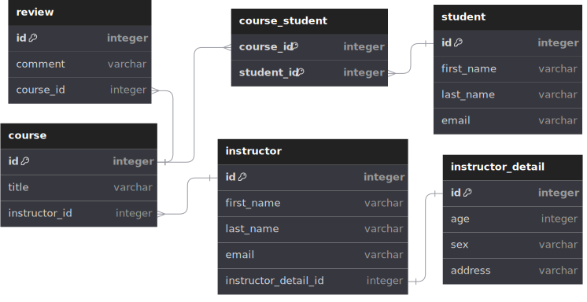

# Spring Boot Rest API Demo

RESTful API is an interface that two computer systems use to exchange information securely over the internet. An application programming interface (API) defines the rules that you must follow to communicate with other software systems. Developers expose or create APIs so that other applications can communicate with their applications programmatically. You can think of a web API as a gateway between clients and resources on the web.

### Client

Clients are users who want to access information from the web. The client can be a person or a software system that uses the API.

### Resources

Resources are the information that different applications provide to their clients. Resources can be images, videos, text, numbers, or any type of data. The machine that gives the resource to the client is also called the server. Organizations use APIs to share resources and provide web services while maintaining security, control, and authentication.

### What is a REST API

REST stands for Representational State Transfer. This means that when a client requests a resource using a REST API, the server transfers back the current state of the resource in a standardized representation. API developers can design APIs using several different architectures. APIs that follow the REST architectural style are called REST APIs. Web services that implement REST architecture are called RESTful web services.

## RestApi Demo

The demo in this repository is for a RESTful API Web Service. It has a MySQL backend database which the web service can view and modify. In this demo the database tracks students and instructors in relation to courses. The entity relationship diagram for the database can be viewed below.

In addition to the Rest Web Service API a Web Application has also been developed to view and modify the resources hosted by the server. It can be accessed through the link [RestApi_Application](https://cqueltech.com/restapi-0.0.1-SNAPSHOT).

### Instructor-Student-Tracking schema


To use the web service/application one must login in first. A user has associated role(s), each role has it's own level of access to the database. The role depicts what can be viewed, modified or created within the datbase. The roles, and their associated database access, are listed below.

- Student role:
  - view courses and associated instructor conducting the course
  - view course reviews.
- Instructor role:
  - view instructors and the associated instructor detail
  - view students enrolled on courses
  - remove students from courses
  - enroll student onto course
- Admin role:
  - create a new course
  - create a new student
  - create a new instructor
 
To create a user just press the `Register User` button in the sign-in page. It just requires a username and password, no personal details are required or stored. By default the user will be created with the `Student` role. The `Instructor` role can also be assigned to the user by checking the applicable check box. The `Admin` role is for database administrators only.

The web service/application is deployed on an Apache Tomcat server with an Apache server acting as a reverse proxy to it.

## Web Service HTTP Request Configuration

### Request Types

All requests are made by adding a specified end point to the following URL: https://cqueltech.com/restapi-0.0.1-SNAPSHOT/api

|Method|Endpoint|Description|
|------|--------|-----------|
|POST|/login|Login to the service passing a JSON request body as set out in the parameters below. Returns an Oauth2 JWT Token to be used in authorizing further requests.|
|GET|/courses|This request returns a list of courses with associated instructor ids. Request requires an Authorization header of format "Bearer your-jwt-token".|
|GET|/course-reviews|Returns a list of submitted reviews for each course. Request requires an Authorization header of format "Bearer your-jwt-token".|
|GET|/instructors|Request returns a list of instructors with associated instructor detail. Requires the aforementioned Authorization header.|
|GET|/students|This request will return a list of courses with all students enrolled on these courses. Requires the aforementioned Authorization header.|
|POST|/enrol-student|This post request enrols a student onto a course. Requires the aforementioned Authorization header.|
|POST|/create-course|Will create a new course using parameters found in the supplied request body. Requires the aforementioned Authorization header.|
|POST|/create-student|Will create a new student using parameters found in the supplied request body. Requires the aforementioned Authorization header.|
|POST|/create-instructor|Will create a new instructor using parameters found in the supplied request body. Requires the aformentioned Authorization header.|

### Request Parameters

Parameters for endpoints are sent via the request body in JSON format, for example the body for the `/login` endpoint is as follows:

```
    {
      "username" : "your-username",
      "password" : "your-password"
    }
```

|Endpoint|Parameter|Type|Description|Required|
|--------|---------|----|-----------|--------|
|/login|username|String|The username for the user logging in to the service.|Yes|
|/login|password|String|The password for the user logging in to the service.|Yes|
|/enrol-student|courseId|Integer|Course id of the course that the student is to be enroled onto.|Yes|
|/enrol-student|studentId|Integer|Id of student to be enroled.|Yes|
|/create-course|title|String|Title of the course.|Yes|
|/create-course|instructorId|Integer|Id of the instructor that teaches the course. Id must be for an instructor that already exists.|Yes|
|/create-student|firstName|String|The first name of the student.|Yes|
|/create-student|lastName|String|The last name of the student.|Yes|
|/create-student|email|String|Email address of the student.|Yes|
|/create-instructor|firstName|String|The first name of the instructor.|Yes|
|/create-instructor|lastName|String|The last Name of the instructor.|Yes|
|/create-instructor|email|String|Email address of instructor.|Yes|
|/create-instructor|age|Integer|Age of instructor.|Yes|
|/create-instructor|sex|String|The sex of the instructor.|Yes
|/create-instructor|address|String|The address for the instructor.|Yes|

### Request Response

All responses to HTTP requests are returned in a specific JSON format as detailed in the tables below.

|Endpoint|Response Attribute|Type|Descrition|
|--------|------------------|----|----------|
|/login|user|Object|An object containing all attributes associated with the user account.|
|/login|user:username|String|Username of user account|
|/login|user:password|String|Password of user account. All passwords stored with BCrypt encryption.|
|/login|user:active|Integer|Defines whether user account is currenly active. 1 -> Active; 0 -> Non-active.|
|/login|user:accountNonLocked|Boolean|Defines if account is loacked or not.|
|/login|user:accountNonExpired|Boolean|Has the accoount expired or not.|
|/login|user:credentialsNonExpired|Boolean|Indicates whether the user's credentials(password) has expired.|
|/login|user:authorities|Array|A set of authorities or roles linked to the user|
|/login|user:authorities:id|Integer|Id of authority/role for the user.|
|/login|user:authorities:username|String|Username identifying the user that the authority/role belongs to.|
|/login|user:authorities:role|String|Role that the user has been authorized to use.|
|/login|user:authorities:authority|String|Authority that the user has been authorized to use.|
|/login|user:enabled|Boolean|Indicates whether the user is enabled or disabled.|
|/login|jwt|String|The JWT Token that has been generated for the user upon successful authorization. Token should be used in further HTTP requests to authorize those requests.|
|All|status|Integer|HTTP status of request.|
|All|message|String|Request message/information/error|
|All|timestamp|String|Timestamp that the request was received.|
|All|array|Array|An array of records retrieved from the web services' database.|
|/courses|array:courseId|Integer|Course Id.|
|/courses|array:title|String|The title of the course.|
|/courses|array:firstName|String|First name of instructor conducting course.|
|/courses|array:lastName|String|Last name of instructor conducting the course.|
|/courses|array:instructorId|Integer|Id of instructor conducting the course.|
|/course-reviews|array:courseId|Integer|Course Id.|
|/course-reviews|array:title|String|The title of the course.|
|/course-reviews|array:comment|String|Student comment on the course.|
|/students|array:courseId|Integer|Course Id that the student is enroled on.|

An example of a login response in JSON format is as follows

```
    {
      "user": {
          "username": "mike",
          "password": "{bcrypt}$2a$10$S5G9Gmmdtjg06xCq58.1eOC2Go62amzp2EXVYbTfy871WF5cSID4O",
          "active": 1,
          "accountNonLocked": true,
          "accountNonExpired": true,
          "credentialsNonExpired": true,
          "authorities": [
              {
                  "id": 6,
                  "username": "mike",
                  "role": "INSTRUCTOR",
                  "authority": "INSTRUCTOR"
              },
              {
                  "id": 5,
                  "username": "mike",
                  "role": "STUDENT",
                  "authority": "STUDENT"
              }
          ],
          "enabled": true
      },
      "jwt": "jwt-token"
    }
```

All subsequent HTTP requests to the login request will have a standardized JSON response. This response has the following attributes:

|Endpoint|Attributes|Type|Description|
|--------|----------|----|-----------|


What follows is an example of the standardized JSON response, in the is case for the `/courses` endpoint.

```
    {
    "status": 200,
    "message": "SUCCESS",
    "timestamp": "09-10-2023 17:59:17",
    "array": [
        {
            "courseId": 1,
            "title": "Maths",
            "firstName": "John",
            "lastName": "Smith",
            "instructorId": 1
        },
        {
            "courseId": 2,
            "title": "Physics",
            "firstName": "John",
            "lastName": "Smith",
            "instructorId": 1
        },
        {
            "courseId": 3,
            "title": "Biology",
            "firstName": "Joe",
            "lastName": "Bloggs",
            "instructorId": 2
        }
    ]
}
```

Should an error occur or a bad request was sent the response will be in the same format detailing the error. The array attribute will of course be empty.
